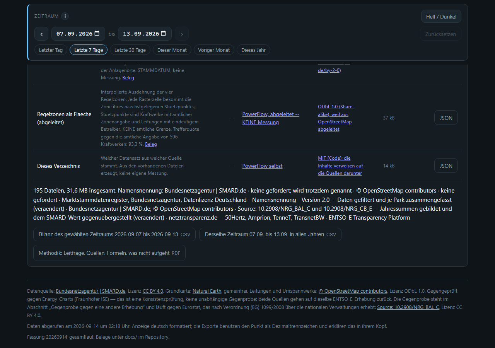

# Der Gesamtlauf über alle Vergleichsjahre

Gebaut am 14.09.2026. Erzeugt vom Abzugsknopf „Derselbe Zeitraum … in allen
Jahren" in `assets/powerflow.js` (`gesamtlaufCsv`).

## Wozu

Diese Seite hat **eine** freie Variable: den Zeitraum. Der eingebaute Vergleich
zeigt ein Jahr zurück — das beantwortet „ist es mehr oder weniger als damals",
aber nicht die Frage dahinter: **hängt das Ergebnis am gewählten Zeitraum, und
wie stark?**

Der Gesamtlauf rechnet denselben Kalenderzeitraum in **jedem** verfügbaren Jahr
durch. Aus einer Zahl wird eine Reihe von zwölf, und daraus Spanne, Median und
Streuung.

## Was dabei herauskommt

Für den 1. bis 7. September, zwölf Jahre (2015–2026), alle vollständig belegt:

| Größe | kleinstes Jahr | Median | größtes Jahr | Spanne |
|---|---|---|---|---|
| Netzlast | 8.246 GWh | 8.923 | 9.302 | **11,8 %** |
| Erzeugung | 7.165 | 9.093 | 9.966 | 30,8 % |
| Residuallast | 2.726 | 6.242 | 7.527 | 76,9 % |
| Export | 541 | 1.097 | 1.691 | 104,8 % |
| Import | 317 | 672 | 1.795 | **220,1 %** |
| Außensaldo | −1.165 | −518 | +1.255 | Vorzeichenwechsel |

**Die Netzlast ist die stabilste Größe** — dieselbe Septemberwoche liegt über
zwölf Jahre innerhalb von 11,8 %. Die **Residuallast** schwankt mit 76,9 %
mehr als sechsmal so stark: das ist der Ausbau von Wind und Photovoltaik, der
den steuerbaren Rest zusammendrückt. Und der **Außensaldo wechselt das
Vorzeichen** — Deutschland war in dieser Woche mal Netto-Ausführer, mal
Netto-Einführer.

Wer eine einzelne Woche aus dieser Reihe zitiert, zitiert also je nach Jahr
etwas völlig anderes. Genau dafür ist die Datei da.

## Drei Dinge, die dabei nicht verrutschen dürfen

### 1. Der 29. Februar

Er hat in elf von zwölf Jahren kein Gegenstück. `tagImJahr()` weicht dann auf
den 28. aus — dieselbe Regel wie beim Vorjahresvergleich der Seite.

Ein Zeitraum **über** den 29.02. ist in Schaltjahren einen Tag länger. Geprüft
am Zeitraum 26.02.–02.03.:

| Jahr | Tage |
|---|---|
| 2024 (Schaltjahr) | **6** |
| 2025 | 5 |
| 2020 (Schaltjahr) | **6** |
| 2021 | 5 |

Deshalb steht die Tageszahl in **jeder** Zeile. Wer Summen ohne diese Rücksicht
vergleicht, vergleicht fünf Tage mit sechs.

### 2. Unvollständige Jahre

Das laufende Jahr endet beim letzten gemeldeten Tag. Ein Zeitraum, der darüber
hinausreicht, hat dort weniger belegte Tage — die Summe ist kleiner, **ohne
dass weniger verbraucht wurde**.

Gemessen am Zeitraum 08.09.–26.02. (über den Jahreswechsel): elf Jahre mit
172 von 172 Tagen, 2026 mit **4 von 172**. Die Streuung läuft deshalb nur über
vollständig belegte Jahre; der Kopf der Datei sagt, wie viele das sind, und
die unvollständigen bleiben mit ihrer Tageszahl trotzdem in der Datei.

### 3. Die Reihen beginnen 2015

Früher gibt es nichts. Das ist keine Null.

## Was in der Datei steht

Eine Zeile je Jahr und Größe, im selben langen Format wie der Einzelabzug:

```
jahr,von,bis,tage,belegt,gruppe,name,wert_mwh
,,,,12,streuung,netzlast_min,8245539.50
,,,,12,streuung,netzlast_spanne_prozent_des_medians,11.84
2015,2015-09-01,2015-09-07,7,7,kennzahl,netzlast,8245539.50
2015,2015-09-01,2015-09-07,7,7,erzeugung,Braunkohle,...
```

Gruppen: `streuung`, `kennzahl`, `erzeugung` (je Träger), `regelzone_netzlast`,
`regelzone_erzeugung`, `regelzone_saldo`, `import` und `export` (je Nachbarland).
Für 01.–07.09. sind das 647 Zeilen.

**Die Streuungszeilen sind gerechnet, nicht gemessen** — das steht im Kopf der
Datei. Die Spanne in Prozent des Medians bleibt leer, wenn der Median nahe null
liegt; eine Prozentzahl wäre dort sinnlos.

## Nachgerechnet

Die Datei ist in einer **zweiten Sprache** gegengeprüft: ein Python-Skript liest
`data/tage/*.json` neu und rechnet jede Zahl nach, ohne eine Zeile des
JavaScript zu benutzen. Ergebnis: **96 Kennzahlen, 0 Abweichungen**; Minimum,
Maximum, Median und Spanne stimmen für alle geprüften Größen auf zwei
Nachkommastellen.

## Wie es auf der Seite aussieht



Der neue Knopf steht neben dem bisherigen. Beide Beschriftungen tragen den
gewählten Zeitraum und ändern sich mit dem Regler — der Gesamtlauf nennt nur
Tag und Monat, weil das Jahr gerade der Punkt ist.

## Prüfungen

- `scripts/validate.py`: die Funktionen stehen im Modul, der Knopf ist da, es
  gibt **genau einen** Abzugsweg für beide CSV-Dateien, und die Streuung läuft
  nur über vollständig belegte Jahre. Zwei Negativtests entfernen die
  Schalttagsregel bzw. den Ausschluss unvollständiger Jahre.
- `scripts/browsertest.mjs`: der Knopf erzeugt wirklich eine Datei — der Blob
  wird abgefangen und gelesen. Geprüft werden Kopf, Spaltennamen, eine Zeile je
  Jahr, die Streuungszeilen und die Tageszahl am Schalttag.

Ein Nebenbefund aus dem Testbau: **den Zeitraum setzt man in drei Schritten.**
Die Seite begrenzt `von` auf ≤ `bis` und umgekehrt; wer nur zwei Felder in der
falschen Reihenfolge setzt, misst einen ganz anderen Zeitraum und merkt es
nicht. Der erste Testlauf hat so 193 Tage statt 6 gemessen.
